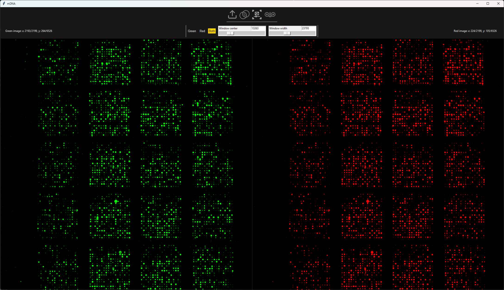

# cDNA microarray viewer

## Program Execution Instructions
Python Version: 3.8 or newer

1. Creating and Activating a Virtual Environment:

```
python -m venv venv
source venv/bin/activate  # Linux/MacOS
venv\Scripts\activate     # Windows
```


2. Installing Dependencies:
`pip install -r requirements.txt`

3. Running the Program:
The program is executed using the main.py file.

## Brief Program Description:
The program allows loading and displaying 16-bit **TIF** files. It is designed for presenting images obtained from reading cDNA microarrays using two markers: **Cy3** and **Cy5**.

Program Features:
- Simultaneous loading of both images
- Displaying each image using the appropriate color palette:
  - Shades of green for the Cy3 channel
  - Shades of red for the Cy5 channel
- Displaying a composite image created by overlaying both channels
- Ability to zoom in (coupled and separate modes) on selected parts of the image
- Adjusting display parameters (window contrast width and center position)

